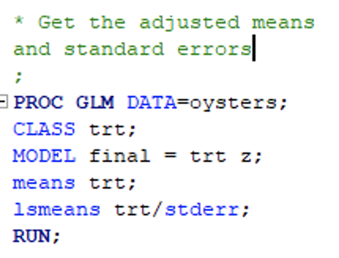
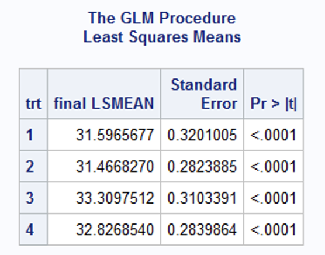

```{r setup, include=FALSE}
knitr::opts_chunk$set(echo = TRUE, warning = FALSE, message = FALSE)
options(scipen = 999)
```

```{r output setup, eval=FALSE, echo=FALSE}
# This code allows us to render a pdf document
rmarkdown::render("~/ST-518/Warren_ST 518 HW 7.Rmd", 
              output_format = "pdf_document", 
              output_options = list(
                toc = TRUE, 
                toc_depth = 3,
                number_sections = TRUE
                )
              )
```

# Problem 1

A person’s blood-clotting ability is typically expressed in terms of a “prothrombin time,” which is defined to be the interval between the initiation of the prothrombin-thrombin (two proteins) reaction and the formation of the final clot. Does *aspirin* affect this function? Measurements made before administration of two tablets and three hours after.

First we are going to read in the data to do our future analysis.
```{r problem 1 read in data}
library(tidyverse)
drug <- read_table("prothrombin.dat")
(
  drug <- drug %>%
    mutate(subject = row_number(),
           difference = before - after) %>%
    dplyr::select(subject, everything())
)
```

## Part A

Carry out a paired t-test of the hypothesis that prothrombin time is unaffected by aspirin.

To do this in R, we are going to use the `t.test()` function that will be shown below. We are looking at the difference between the before and after effects of taking aspirin on the prothrombin time. In this case, we can say our null hypothesis is $H_0: \mu_{before} - \mu_{after} = 0$ with our alternative hypothesis saying that $H_A: \mu_{before} - \mu_{after} \neq 0$. We are going to do this test below.
```{r problem 1 t test}
# Transform the data to make it applicable for R t.test
drug_transform <- drug %>%
  pivot_longer(cols = c("before", "after"), 
               names_to = "time", 
               values_to = "response") %>% 
  mutate(subject = as.factor(subject)) %>%
  select(- difference)

# Do t.test
t.test(formula = drug_transform$response ~ drug_transform$time,
       alternative = "two.sided",
       mu = 0, 
       paired = TRUE,   
       var.equal = TRUE,
       conf.level = 0.95) -> t_test_result

t_test_result
```

As we can see from our statistical test, we get a test statistic value ($t$) of `r t_test_result$statistic[[1]]`, a degrees of freedom of `r t_test_result$parameter[[1]]`, and a resulting p-value is `r t_test_result$p.value`. This p-value is higher than most significance levels we would use for hypothesis testing. Because of this we are failing to reject the null hypothesis that prothrombin time is unaffected by aspirin. As a result we can say that the difference in prothrombin time does not differ significantly after taking aspirin.

## Part B

Carry out an F-test of the same hypothesis treating subjects as blocks in an analysis for a RCBD.

Here we are going to make a model by saying $Y_{ij} = \mu + \alpha_i + B_j + E_{ij}$ where $i = 1, 2$ (represents the before and after taking aspirin) and $j = 1, 2, ..., 12$ (the number of subjects). We are going to fit this model below also using our transformed data.
```{r fit model problem 1}
problem1_blocking_model <- lm(response ~ subject + time, drug_transform)
```

Now we are going to do our test which is looking at the difference between the before and after effects of taking aspirin on the prothrombin time. In this case, we can say our null hypothesis is $H_0: \alpha_1 - \alpha_2 = 0$ with our alternative hypothesis saying that $H_A: \alpha_1 - \alpha_2 \neq 0$. We are going to do an F-test by using the `anova()` function on our fitted model and see what the `time` variable gives us. We are going to do this test below.
```{r problem 1 anova table}
problem1_anova <- anova(problem1_blocking_model)

problem1_anova
```

As we can see from our statistical test, we get a test statistic value ($F$) of `r problem1_anova$"F value"[[2]]`, a degrees of freedom of numerator `r problem1_anova$"Df"[[2]]` and denominator `r problem1_anova$"Df"[[3]]`, and a resulting p-value is `r problem1_anova$"Pr(>F)"[[2]]`. As this is the same p-value as in **Part A**, this p-value is higher than most significance levels we would use for hypothesis testing. Because of this we are failing to reject the null hypothesis that prothrombin time is unaffected by aspirin. As a result we can say that the difference in prothrombin time does not differ significantly after taking aspirin.

## Part C

Show that, in general, the paired t-test is equivalent to the F-test for the RCBD with block size equal to 2.

We know from our class (I think covered in Module 2 or 3) but also in the practice of statistics that there is a relationship between the F-distribution and t-distribution. It follows that the F-value of something with numerator degrees of freedom 1 and denominator degrees of freedom $m$ is equal to the squared value t-value with $m$ degrees of freedom; moreover, $F(1, m) = [t(m)]^2$. Well whenever we have a size of two for our blocks when doing a F-test, the numerator degrees of freedom will always be $2-1=1$. The denominator degrees of freedom will always be the observation size in the data $2n$, where $n$ is the number of subjects, subtracting the number of degrees of freedom for subject + blocks + 1. Because of 2 blocks, degrees of freedom for blocks is $2-1=1$ and degrees of freedom for subject is $n-1$ where $n$ is the number of subjects. Therefore, the denominator degrees of freedom, $m = 2n - (1 + n - 1 + 1) = 2n - (n+1) = n - 1$. Now if we can prove that in a paired t-test that the degrees of freedom, $m = n - 1$ then we will have shown that when the number of blocks is true, then we have $F(1, m) = [t(m)]^2$. For a two sample t-test we know the degrees of freedom is $m = n - 1$. Therefore, the degrees of freedom for a t-test is the same as the denominator degrees of freedom for a F-test when having 2 blocks. Therefore, with 2 blocks $F(1, m) = [t(m)]^2$ holds and why that in general the paired t-test is equivalent to the F-test for the RCBD with block size equal to 2.

## Part D

Consider the linear mixed effects model (or just “mixed model”), $Y_{ij} = \mu + \alpha_i + B_j + E_{ij}$ where $B_j \sim^{iid} N(0, \sigma_B^2), E_{ij} \sim^{iid} N(0, \sigma^2)$ with $B \bot E$ for $i = 1, ... , a = 2, j = 1, ..., b = 12$.

### Part i

Show that $E[MS(block)] = \sigma^2 + a\sigma_B^2$.

We from our lecture that $\hat{\sigma_B^2} = \frac{1}{a} (MS(Block) - MS(E))$. We are going to manipulate this formula to get $MS(Block)$ by itself. So,

$$\hat{\sigma_B^2} = \frac{1}{a} (MS(Block) - MS(E))$$
$$a\hat{\sigma_B^2} = MS(Block) - MS(E)$$
$$a\hat{\sigma_B^2} + MS(E) = MS(Block)$$

Now we want to find $E[MS(Block)]$ so using $MS(Block) = a\hat{\sigma_B^2} + MS(E)$, we get that $E[MS(Block)] = E[a\hat{\sigma_B^2} + MS(E)] = E[a\hat{\sigma_B^2}] + E[MS(E)] = a\sigma_B^2 + \sigma^2$ since we know from past lectures that $E[MS(E)] = \sigma^2$. So $E[MS(Block)] = a\sigma_B^2 + \sigma^2$.

### Part ii

Use this result to estimate the variance component for subject effects in a mixed model for the prothrombin data.

We know that $E[MS(Block)] = a\sigma_B^2 + \sigma^2$ which means that $MS(Block) = a\hat{\sigma_B^2} + \hat{\sigma^2}$. We want to find $\hat{\sigma_B^2}$ so we can change our formula $MS(Block) = a\hat{\sigma_B^2} + \hat{\sigma^2}$ to get this by saying $MS(Block) = a\hat{\sigma_B^2} + \hat{\sigma^2} <===> MS(Block) - \hat{\sigma^2} = a\hat{\sigma_B^2} <===> \frac{MS(Block) - \hat{\sigma^2}}{a} = \hat{\sigma_B^2}$. So $\hat{\sigma_B^2} = \frac{MS(Block) - \hat{\sigma^2}}{a}$ and we can use our anova table to help get these values. A reminder of our anova table is below.
```{r problem 1 anova table again}
problem1_anova
```

As we can see from this table, we can find that $MS(Block) = MS(Subject) =$ `r problem1_anova$"Mean Sq"[[1]]`. We also know that $\hat{\sigma^2} = MS(E) =$ `r problem1_anova$"Mean Sq"[[3]]`. Lastly, $a$ is the number of levels in our other variable (in this case `time`) which is 2. So $a = 2$. Therefore, $\hat{\sigma_B^2} = \frac{MS(Block) - \hat{\sigma^2}}{a} =$ $(1/2) *$(`r problem1_anova$"Mean Sq"[[1]]` - `r problem1_anova$"Mean Sq"[[3]]`) = `r .5 * (problem1_anova$"Mean Sq"[[1]] - problem1_anova$"Mean Sq"[[3]])`. Therefore, $\hat{\sigma_B^2} =$ `r .5 * (problem1_anova$"Mean Sq"[[1]] - problem1_anova$"Mean Sq"[[3]])`.

### Part iii (Told in Discussion Board we do not have to do)

Report an estimate of the intra-subject correlation. Is the scatterplot above consistent with this estimate?

Based on the discussion board post, we are told to solve this by using the formula $\frac{\sigma_S^2}{\sigma_S^2 + \sigma^2}$. We know that $\sigma_S^2 = \sigma_B^2 =$ `r .5 * (problem1_anova$"Mean Sq"[[1]] - problem1_anova$"Mean Sq"[[3]])` and $\sigma^2$ = `r problem1_anova$"Mean Sq"[[3]]`. Therefore, the correlation is `r .5 * (problem1_anova$"Mean Sq"[[1]] - problem1_anova$"Mean Sq"[[3]])` / (`r .5 * (problem1_anova$"Mean Sq"[[1]] - problem1_anova$"Mean Sq"[[3]])` + `r problem1_anova$"Mean Sq"[[3]]`) = `r (.5 * (problem1_anova$"Mean Sq"[[1]] - problem1_anova$"Mean Sq"[[3]])) / (.5 * (problem1_anova$"Mean Sq"[[1]] - problem1_anova$"Mean Sq"[[3]]) + problem1_anova$"Mean Sq"[[3]])`, which is a fairly strong correlation. When comparing to the scatterplot, there seems to be weak correlation on this so the results from the estimate and the scatterplot do not seem to match up.

# Problem 2

Fuel efficiency of four blends of gasoline is measured
in MPG. There is considerable variability due to driver. Another source of variability is model of car. An experiment randomizes four models of car and gasoline blends (A,B,C,D) to drivers according to the design below:

|Driver | Model 1 | Model 2 | Model 3 | Model 4 |
|:----|:-----:|:-----:|:-----:|-----:|
|1 |15.5(A)| 33.8(B)| 13.7(C)| 29.2(D)|
|2 |16.3(B) |26.4(C) |19.1(D) |22.5(A)|
|3 |10.5(C) |31.5(D) |17.5(A) |30.1(B)|
|4 |14.0(D) |34.5(A) |19.7(B) |21.6(C)|

## Part A

Assuming normally distributed data, propose a model in which the effects of model, driver and blend are additive on the mean.

We can make a model that is found from what we have learned for Latin Squares (as this experiment is designed in this way) as $Y_{ij} = \mu + \rho_i + \kappa_j + \tau_k + E_{ij}$ where $i = 1, 2, 3, 4; j = 1, 2, 3, 4; E_{ij} \sim^{iid} N(0, \sigma^2)$ and $k$ is determined by the design.

Now we are going to put this model into R. First we are going to store the data and then we are going to make the appropriate model.
```{r make data problem 2}
# Make vector of rows
model <- rep(1:4, 4)
driver <- c(rep(1, 4), rep(2, 4), rep(3, 4), rep(4, 4))
gas_blend <- c(LETTERS[1:4], LETTERS[c(2:4, 1)], LETTERS[c(3:4, 1:2)], LETTERS[c(4, 1:3)])
mpg <- c(15.5, 33.8, 13.7, 29.2, 
         16.3, 26.4, 19.1, 22.5, 
         10.5, 31.5, 17.5, 30.1,
         14.0, 34.5, 19.7, 21.6)

# Make data frame
mpg_df <- data.frame(driver, model, gas_blend, mpg) %>%
  mutate(driver = as.factor(driver),
         model = as.factor(model),
         gas_blend = as.factor(gas_blend))

# Make model
mpg_model <- lm(mpg ~ driver + model + gas_blend, mpg_df)
```

## Part B

Obtain an ANOVA table for this model.

Here we are going to show the ANOVA table below for our model
```{r anova table problem 2}
(problem2_anova <- anova(mpg_model))
```

Something to note is that it seems to be that the driver is said to not be significantly different so it is plausible to think that driver could potentially not make a difference.

## Part C

Report the average fuel efficiency for each blend and the lowest level of significance $\alpha$ at which these averages can be said to differ significantly.

First we are going to find the average fuel efficiency for each blend.
```{r problem 2 group by mean}
(
  mpg_blend_avgs <- mpg_df %>%
    group_by(gas_blend) %>%
    summarize(avg_mpg = mean(mpg))
)
```

We can see the average mpg for each gas blend with gas blend **B** having the highest and gas blend **C** having the lowest. From our anova table we can see that the `gas_blend` variable p-value is `r problem2_anova$"Pr(>F)"[[3]]` which by definition is also the lowest level of significance $\alpha$ at which these averages can be said to differ significantly. Therefore, the lowest level of significance $\alpha$ at which these averages can be said to differ significantly is `r problem2_anova$"Pr(>F)"[[3]]`.

# Problem 3

For each of several species, an Ecology researcher ran an exposure assay in which groups of $n = 50$ ants are measured for mortality after exposure to one of three different bacteria. For each species, ants are randomized to the three bacteria treatments within each of 15 colonies. That is, a randomized complete block design is used for each species, with colonies serving as complete blocks. Find the results for the DB species on moodle as **“DBdat.mtx”**.

Here we are going to read in the data.
```{r problem 3 read in data}
(
  db <- read_csv("DBdat.mtx", skip = 1) %>%
    mutate(Colony = as.factor(Colony))
)
```

## Part A

Watch the video on the `hiddenf` package. What is the name of the function in R that will create a directory system containing all of the help files that a developer can complete to create documentation for a package? `____-skeleton`.

The function is called `package.skeleton`.

## Part B

Obtain an interaction plot with proportion of ants dying out of $n = 50$ on the vertical axis, bacteria treatment on the horizontal axis and lines connecting mortality rates from the same colony.

Here we are going to make an interaction plot as described above. We need to pivot our data to a longer format do make this work. We will do this first.
```{r pivot longer db data}
(
  db_longer <- db %>%
    pivot_longer(cols = Control:E.coli, 
                 names_to = "bacteria", 
                 values_to = "rates")
)
```

Now we are going to make the interaction plot as described in the directions.
```{r problem 3 interaction plot 1}
db_longer %>%
  ggplot(aes(x = bacteria, y = rates)) + 
  geom_point(aes(color = Colony)) + 
  geom_line(aes(group = Colony, color = Colony)) +
  labs(x = "Bacteria Type",
       y = "Proportion of Ants Dying",
       color = "Colony",
       title = "What Proportion of Ants are Dying by Which Bacteria",
       caption = "Eric Warren") +
  theme_bw()
```

It seems that **E.coli** has a spike in the proportion of ants dying in each colony.

## Part C

Either by using the `hiddenf` package in R, or by assigning colonies to groups, obtain an ANOVA table with the following sources of variability: treatments, groups, group-by-treatment interaction, colony within group.


## Part D

Obtain the p-value for the test of group-by-treatment interaction after and report it after multiplying by $2^{15-1} - 1$. Is there evidence that the resistance to bacteria varies across colonies?

## Part E

Obtain another plot of survival versus bacteria with different lines for colonies. Color the colony lines according to group.

# Problem 4

An experiment investigates the growth of oysters. Four bags with ten oysters each are randomly placed at four underwater stations next to a power plant:

- Trt1: At the bottom of a discharge canal
- Trt2: At the top of a discharge canal
- Trt3: At the bottom of an intake canal
- Trt4: At the top of an intake canal

Average initial weight x and final weight y are
measured for each of the 16 bags. (Bags serve as the experimental units.) Let $z = x - \bar{x}$ denote the difference from average of the initial weights. SAS code and output to fit an ANCOVA model appear at the end of the exam.

First we will read in the data to make sure we can do our analysis later.
```{r problem 4 read in}
(oysters <- read_table("oysters.dat") %>%
   mutate(trt = as.factor(trt)))
```

## Part A

Obtain the F-ratio for a test of equal final weights in a one-way ANOVA where initial weight $z$ is ignored.

If we ignore the initial weight then we are only fitting a model with `final` being our response variable and `trt` being our only predictor. Thus, we can make the model below with the appropriate anova table
```{r anova ignore z}
# Make the model
ignore_z_model <- lm(final ~ trt, oysters)

# Show anova table
(anova_ignore_z <- anova(ignore_z_model))
```

As we can see in our one way anova table, we can that the F-value for our test of equal weights is `r anova_ignore_z$"F value"[[1]]` with a degrees of freedom of `r anova_ignore_z$"Df"[[1]]`, `r anova_ignore_z$"Df"[[2]]`. This gets us a corresponding p-value of `r anova_ignore_z$"Pr(>F)"[[1]]`, which gives us a conclusion that we do not have statistically significant evidence to say that the final weights of each treatment are different. Therefore, we can say that the final weights of each bag are plausibly the same.

To answer the question, we found the F-ratio is `r anova_ignore_z$"F value"[[1]]` with a degrees of freedom of `r anova_ignore_z$"Df"[[1]]`, `r anova_ignore_z$"Df"[[2]]`.

## Part B

Obtain the F-ratio for a test of equal final weights in a one-way ANOVA after controlling for initial weight $z$.

Here when controlling for the initial weight we are looking at two models to compare our anova table on. The first model is the full model of $Y_i = \beta_0 + \beta_1x_{1i} + \beta_2x_{2i} + \beta_3x_{3i} + \beta_zx_i$ and the reduced model we are comparing to is $Y_i = \beta_0 + \beta_zx_i$. We can do this test below where our $H_0: \beta_1 = \beta_2 = \beta3 = 0$ and $H_A: \geq 1 \beta_i \neq 0$. We are going to do this test in our code chunk below.
```{r control z test}
full_model <- lm(final ~ trt + z, oysters)
reduced_model <- lm(final ~ z, oysters)

(control_z_anova <- anova(reduced_model, full_model))
```

As we can see in our one way anova table, we can that the F-value for our test of equal weights after controlling for initial weight $z$ is `r control_z_anova$"F"[[1]]` with a degrees of freedom of `r control_z_anova$"Df"[[2]]`, `r control_z_anova$"Res.Df"[[2]]`. This gets us a corresponding p-value of `r control_z_anova$"Pr(>F)"[[2]]`, which gives us a conclusion that we have statistically significant evidence to say that the final weights of each treatment are different after controlling for initial weight $z$.

To answer the question, we found the F-ratio is is `r control_z_anova$"F"[[1]]` with a degrees of freedom of `r control_z_anova$"Df"[[2]]`, `r control_z_anova$"Res.Df"[[2]]`.

## Part C

Use the output to report the unadjusted means for treatments 1 and 4. (Use the 2nd column in the table below.)

|Treatment | Unadjusted Mean | Adjusted Mean | Standard Error |
|:----|:-----:|:-----:|:-----:|-----:|
|1 | | | |
|4 | | | |

We can get the unadjusted means by taking the average of each treatment's response (which comes from the column `final`). We are going to take the means of each treatment below.
```{r oyster unadjusted mean}
(
  oyster_unadjusted_means <- oysters %>%
    group_by(trt) %>%
    summarize(avg = mean(final))
)
```

Here we can see that the unadjusted average for treatment 1 is `r oyster_unadjusted_means$avg[[1]]` and the unadjusted average for treatment 4 is `r oyster_unadjusted_means$avg[[4]]`. Now our chart looks like this:

|Treatment | Unadjusted Mean | Adjusted Mean | Standard Error |
|:----|:-----:|:-----:|:-----:|-----:|
|1 | `r oyster_unadjusted_means$avg[[1]]`| | |
|4 | `r oyster_unadjusted_means$avg[[4]]`| | |

Note this matches the output we are given in the homework problem, but it is good to know the steps if we had to code this ourselves from scratch.

## Part D

For bag i, let $x_{i1}, ... , x_{i4}$ denote indicator variables for treatments 1-4, respectively. Consider the analysis of covariance model: $Y_i = \beta_0 + \beta_1x_{1i} + \beta_2x_{2i} + \beta_3x_{3i} + \beta_4x_{4i} + \beta_zx_i + E_i$

### Part i

Use the fitted model to report the mean final weight, after adjustment to the average initial weight $\bar{x}$, for treatments 1 and 4. Fill in the table above, show any work below.

Now remember our table from **Part C** which is below:

|Treatment | Unadjusted Mean | Adjusted Mean | Standard Error |
|:----|:-----:|:-----:|:-----:|-----:|
|1 | `r oyster_unadjusted_means$avg[[1]]`| | |
|4 | `r oyster_unadjusted_means$avg[[4]]`| | |

We are now going to find the adjusted means for the treatments. Here we are going to group the treatments and find the mean of the `z` variable. We do this below.
```{r z averages}
(
  z_averages <- oysters %>%
    group_by(trt) %>%
    summarize(avg = mean(z))
)
```

Note this matches the output we are given in the homework problem, but it is good to know the steps if we had to code this ourselves from scratch.

Now we are going to find the $\bar{z}$ or the average of the covariates. In this case we know that $\bar{z} = \frac{\bar{z_1} + \bar{z_2} + \bar{z_3} + \bar{z_4}}{4} =$ (`r z_averages$avg[[1]]` + `r z_averages$avg[[2]]` + `r z_averages$avg[[3]]` + `r z_averages$avg[[4]]`) / 4 = `r (z_averages$avg[[1]] + z_averages$avg[[2]] + z_averages$avg[[3]] + z_averages$avg[[4]]) / 4`. Therefore, we can use this by saying that $\bar{z} =$ `r (z_averages$avg[[1]] + z_averages$avg[[2]] + z_averages$avg[[3]] + z_averages$avg[[4]]) / 4`. This value makes sense since $z$ is found by subtracting from a mean of another value by the original value so we should get the mean minus the mean (on average) which gives the value of `r (z_averages$avg[[1]] + z_averages$avg[[2]] + z_averages$avg[[3]] + z_averages$avg[[4]]) / 4`. Again for practice, it is good to know the math behind it for in the future when this is not the case.

Now we can find the adjusted means for treatments 1 and 4 below using the formula to find the adjusted mean of treatment $i$ of $\bar{y_{i, a}} = \hat{\beta_0} + \hat{\beta_i} + \hat{\beta_z} * \bar{z}$. Note to get the exact values to match up with the correct answers we are going to use the SAS output on the last page of the homework to get the "correct" values for each $\beta_i$. We are first going to list what SAS has for each $\beta_i$ value which is slightly different that how I have found it in R. 

- $\beta_0 = 32.82685402$
- $\beta_1 =  -1.23028630$
- $\beta_2 =  -1.36002698$
- $\beta_3 = 0.48289720$
- $\beta_4 = 0$
- $\beta_z =  1.04670265$

We can plug this formula $\bar{y_{i, a}} = \hat{\beta_0} + \hat{\beta_i} + \hat{\beta_z} \bar{z}$ in below with our respective treatments to find:

- Treatment 1: $\bar{y_{1, a}} = \hat{\beta_0} + \hat{\beta_1} + \hat{\beta_z}* \bar{z} = 32.82685402 + (-1.23028630) + 1.04670265$ x `r (z_averages$avg[[1]] + z_averages$avg[[2]] + z_averages$avg[[3]] + z_averages$avg[[4]]) / 4` = `r 32.82685402 - 1.23028630 + (1.04670265 * ((z_averages$avg[[1]] + z_averages$avg[[2]] + z_averages$avg[[3]] + z_averages$avg[[4]]) / 4))`
- Treatment 4: $\bar{y_{4, a}} = \hat{\beta_0} + \hat{\beta_4} + \hat{\beta_z} \bar{z} = 32.82685402 + 0 + 1.04670265$ x `r (z_averages$avg[[1]] + z_averages$avg[[2]] + z_averages$avg[[3]] + z_averages$avg[[4]]) / 4` = `r 32.82685402 + 0 + (1.04670265 * ((z_averages$avg[[1]] + z_averages$avg[[2]] + z_averages$avg[[3]] + z_averages$avg[[4]]) / 4))`. This makes sense that this value is just the `intercept` value we get in our output since our output is done with the parameter estimates corresponding to the parameterization with treatment 4 set to 0.

Now we can update our table with the following values by plugging in our adjusted means.

|Treatment | Unadjusted Mean | Adjusted Mean | Standard Error |
|:----|:-----:|:-----:|:-----:|-----:|
|1 | `r oyster_unadjusted_means$avg[[1]]`| `r 32.82685402 - 1.23028630 + (1.04670265 * ((z_averages$avg[[1]] + z_averages$avg[[2]] + z_averages$avg[[3]] + z_averages$avg[[4]]) / 4))`| |
|4 | `r oyster_unadjusted_means$avg[[4]]`| `r 32.82685402 + 0 + (1.04670265 * ((z_averages$avg[[1]] + z_averages$avg[[2]] + z_averages$avg[[3]] + z_averages$avg[[4]]) / 4))`| |

### Part ii

Report the standard error for the adjusted means for locations 1 and 4. (Fill in the table, writing “NP” if it is not possible to give a number based on the provided output.)

The formula to find the standard error is $\hat{SE} = \sqrt{c' (X'X)^{-1} c MS(E)}$. Given we do not have $(X'X)^{-1}$ from the output, this would make it very difficult to solve. The good news is that we can do this in SAS and get these estimates. I have attached images of the code and output below.





As we can see the standard error for treatment 1 is 0.3201005 and the standard error for treatment 4 is 0.2839864 (which seems to match the intercept standard error). We can now fill out our table completely. 

|Treatment | Unadjusted Mean | Adjusted Mean | Standard Error |
|:----|:-----:|:-----:|:-----:|-----:|
|1 | `r oyster_unadjusted_means$avg[[1]]`| `r 32.82685402 - 1.23028630 + (1.04670265 * ((z_averages$avg[[1]] + z_averages$avg[[2]] + z_averages$avg[[3]] + z_averages$avg[[4]]) / 4))`| 0.3201005|
|4 | `r oyster_unadjusted_means$avg[[4]]`| `r 32.82685402 + 0 + (1.04670265 * ((z_averages$avg[[1]] + z_averages$avg[[2]] + z_averages$avg[[3]] + z_averages$avg[[4]]) / 4))`| 0.2839864|

## Part E

Consider the difference between mean final weights under treatments 1 and 4. Estimate this difference after controlling for initial weight. Report a standard error and a p-value for a test of no difference.

So when we want to look at the mean final weights under treatments 1 and 4 after controlling for initial weight, we are just looking at our adjusted mean values. Since we are parameterizing on treatment 4, as described before, this esimated difference between the two treatments is just $\hat{\beta_1} = -1.23028630$ since $\hat{\beta_1} =$ adjusted mean from treatment 1 - adjusted mean from treatment 4. To continue our standard error is just the $SE(\hat{\beta_1}) = 0.43892225$. Now our hypothesis test to see if there is any difference between the two treatments' adjusted means is just testing with $H_0: \beta_1 = 0$ and $H_A: \beta_1 \neq 0$. The good news is that our output gives us a t-value of 2.80 (could also be solved by doing $(1.23028630 - 0)/0.43892225$) with 11 degrees of freedom (from the error degrees of freedom in our output) and this gives us a two sided test p-value of about 0.0172, which can be found from output or by doing `2 * pt((1.23028630 - 0)/0.43892225, 11, lower.tail = F)` in R. This test would tell us that there is a statistically significant difference in mean final weights under treatments 1 and 4 after controlling for initial weight.