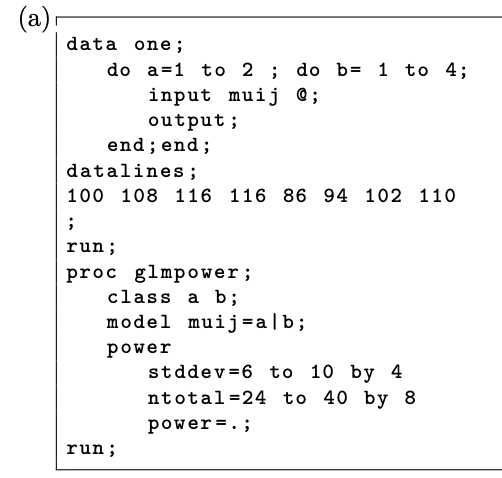

```{r setup, include=FALSE}
knitr::opts_chunk$set(echo = TRUE, warning = FALSE, message = FALSE)
options(scipen = 999)
```

```{r output setup, eval=FALSE, echo=FALSE}
# This code allows us to render a pdf document
rmarkdown::render("~/ST-518/Warren_ST 518 HW 8.Rmd", 
              output_format = "pdf_document", 
              output_options = list(
                toc = TRUE, 
                toc_depth = 3,
                number_sections = TRUE
                )
              )
```

# Problem 1

An experiment randomizes seeds from `t = 10` plants from an F2 generation of soybeans to `N = 30` homogeneous plots. The percentage protein content is measured in the seds from the plants produced in each plot with results below and in the file **“protein-content.dat”**.

First we are going to read in the data.
```{r read in problem 1 data}
library(tidyverse)
(
  protein <- read_table("protein-content.dat") %>%
    mutate(Plant = as.factor(Plant))
)
```

Consider a random effects model for these protein contents:
$Y_{ij} = \mu + T_i + E_{ij}$.

## Part A

Give all distributional assumptions and limits on indices/subscripts i and j.

- $i = 1, 2, ..., t$ or in this case $i = 1, 2, ..., 10$
- $j = 1, 2, ..., n$ or in this case $j = 1, 2, 3$
- $T_1, T_2, ..., T_t \sim^{iid} N(0, \sigma_T^2)$ or in this case $T_1, T_2, ..., T_10 \sim^{iid} N(0, \sigma_T^2)$
- $E_{11}, ..., E_{tn} \sim^{iid} N(0, \sigma^2)$ or in this case $E_{11}, ..., T_{10,3} \sim^{iid} N(0, \sigma^2)$
- $T_1, T_2, ..., T_t$ are independent of $E_{11}, ..., E_{tn}$ or in this case $T_1, T_2, ..., T_10$ are independent of $E_{11}, ..., E_{10, 3}$

## Part B

Test for a genetic component to protein content. That is, test $H_0: Var(T_i) = 0$.

We are going to test $H_0: Var(T_i) = 0$ with $H_A: Var(T_i) \neq 0$. We know that should do a F-test where $F = \frac{MS(T)}{MS(E)}$. We are going to get the anova table of these values below but first we have to transform the data to do this. We will say our significance level $\alpha = 0.05$.
```{r problem 1 anova b}
# Transform data
protein_transform <- protein %>%
  pivot_longer(Plot1:Plot3, names_to = "plot", values_to = "content")

# Make the model
model1 <- lm(content ~ Plant, protein_transform)

# Get anova table 
(anova_model1 <- anova(model1))
```

As we can see our F-value $F = \frac{MS(T)}{MS(E)} = 2.1801$ with 9, 20 degrees of freedom. We can see our p-value is `r anova_model1$"Pr(>F)"[[1]]` which is higher than our significance level determined of $\alpha = 0.05$. Thus, we fail to reject our $H_0$ and can say that it is plausible that $Var(T_i) = 0$.

## Part C

We need to find $A$, $A^{-1}$, and $\hat{\theta}$. 

Now we know that $A\theta = MS$. Therefore to find just $A$, we can say that $A = MS \, \theta'$. We know that $MS = \begin{pmatrix} MS(T) \\ MS(E) \end{pmatrix}$ which from **Part C** directions we can plug in $MS(T) = 3\sigma_T^2+\sigma^2$ and $MS(E) = \sigma^2$. Thus, $MS = \begin{pmatrix} MS(T) \\ MS(E) \end{pmatrix} = \begin{pmatrix} 3\sigma_T^2+\sigma^2 \\ \sigma^2 \end{pmatrix}$. Now we know that $\theta = \begin{pmatrix} \sigma_T^2 & \sigma^2 \end{pmatrix}$.

Now we can let us plug in and then solve for $A$. Our base equation is $A\theta =MS$. Plugging everything in we get $\begin{pmatrix} a_{11} & a_{12} \\ a_{21} & a_{22} \end{pmatrix} \begin{pmatrix} \sigma_T^2 & \sigma^2 \end{pmatrix} = \begin{pmatrix} 3\sigma_T^2+\sigma^2 \\ \sigma^2 \end{pmatrix}$. Using what we know about matrix multiplication we can get that this turns into equations $a_{11} \sigma_T^2 + a_{12} \sigma^2 = 3\sigma_T^2+\sigma^2$ and $a_{21} \sigma_T^2 + a_{22} \sigma^2 = \sigma^2$. We can clearly solve for the following to be true which is $a_{11} = 3, a_{12} = 1, a_{21} = 0, a_{22} = 1$. Thus, $A = \begin{pmatrix} 3 & 1 \\ 0 & 1 \end{pmatrix}$. A possible general solution based on the math we have done could be that $A = \begin{pmatrix} n & 1 \\ 0 & 1 \end{pmatrix}$.

Now we can find $A'$ as the inverse of $A$. Thus, $A^{-1} = \begin{pmatrix} 3 & 1 \\ 0 & 1 \end{pmatrix}^{-1} = \frac{1}{det \begin{pmatrix} 3 & 1 \\ 0 & 1 \end{pmatrix}} \begin{pmatrix} 1 & -1 \\ 0 & 3 \end{pmatrix} = \begin{pmatrix} \frac{1}{3} & \frac{-1}{3} \\ 0 & 1 \end{pmatrix}$. A possible general solution based on the math we have done could be that $A^{-1} = \begin{pmatrix} \frac{1}{n} & \frac{-1}{n} \\ 0 & 1 \end{pmatrix}$.

Now we can find $\hat{\theta} = A^{-1} MS = \begin{pmatrix} \frac{1}{3} & \frac{-1}{3} \\ 0 & 1 \end{pmatrix} \begin{pmatrix} 3\hat{\sigma_T^2}+\hat{\sigma^2} \\ \hat{\sigma^2} \end{pmatrix} = \begin{pmatrix} \hat{\sigma_T^2} \\ \hat{\sigma^2} \end{pmatrix}$ which makes sense since we expect $\hat{\theta} = \begin{pmatrix} \hat{\sigma_T^2} \\ \hat{\sigma^2} \end{pmatrix}$ because $\theta = \begin{pmatrix} \sigma_T^2 \\ \sigma^2 \end{pmatrix}$. In this case $\hat{\sigma^2} = MS(E) = 5.702$ and $\hat{\sigma_T^2} = \frac{MS(T) - MS(E)}{n} = \frac{12.431 - 5.702}{3} = 2.243$ so $\hat{\theta} = \begin{pmatrix} \hat{\sigma_T^2} \\ \hat{\sigma^2} \end{pmatrix} = \begin{pmatrix} 2.243 \\ 5.702 \end{pmatrix}$

## Part D

Estimate the coefficient of variation among protein contents.

We need to know $\hat{\sigma_T^2}$ which we can find is $\hat{\sigma_T^2} = \frac{MS(T) - MS(E)}{3} = \frac{12.431-5.702}{3} = 2.243$. We also need to know $\hat{\mu} = E(\hat{Y_{ij}}) =$ `mean(protein_transform$content)` = `r mean(protein_transform$content)`. The coefficient of variation among protein contents is $CV(Y_{ij}) = \frac{\sqrt{\sigma_T^2 + \sigma^2}}{|\hat{\mu}|} = \frac{\sqrt{\sigma_T^2 + \sigma^2}}{|\bar{y..}|} = \frac{\sqrt{2.243 + 5.702}}{|39.09333|} = 0.0721015$. Thus, the coefficient of variation among protein contents is 0.0721015 or $7.21015\%$.

## Part E

Estimate $Corr(Y_{21}, Y_{22})$, the so-called *heritability* of protein content.

Note from **Part D** we found that $\hat{\sigma_T^2} = 2.243$.

We know we can find this as $Corr(Y_{21}, Y_{22}) = \frac{Cov(Y_{21}, Y_{22})}{\sqrt{Var(Y_{21})Var(Y_{22})}} = \frac{\hat{\sigma_T^2}}{\hat{\sigma_T^2} + \hat{\sigma^2}} = \frac{2.243}{2.243 + 5.702} = 0.2823159$. Therefore, the so-called *heritability* of protein content is 0.2823159.

## Part F

Report a $95\%$ confidence interval for the mean protein content $\mu$ of seeds grown from a randomly sampled Plant.

We know this confidence interval formula is $\bar{y..} \pm t(0.025, t-1) \sqrt{\frac{MS(T)}{nt}}$. We know that $t = 10, n = 3, \bar{y..} = 39.09333, MS(T) = 12.431$ so our confidence interval is $39.09333 \pm t(0.025, 10-1) \sqrt{\frac{12.431}{3*10}} ===> 39.09333 \pm t(0.025, 9) \sqrt{\frac{12.431}{30}} ===> 39.09333 \pm 2.262157 * 0.6437132 ===> 39.09333 \pm 1.45618$ which gives us a lower interval of `r 39.09333 - 1.45618` and upper confidence interval of `r 39.09333 + 1.45618`. Thus our $95 \%$ confidence interval for the mean protein content $\mu$ of seeds grown from a randomly sampled Plant is `r 39.09333 - 1.45618` to `r 39.09333 + 1.45618`.

## Part G

Plot the residuals from the fitted model, $y_{ij} - \bar{y{i.}}$ against the fitted values, , $\hat{y_{ij}} = \bar{y{i.}}$. Use a different plotting symbol or color for each of the 10 plants.

First we need to get the fitted values for our data. Then we will graph the residuals.
```{r precict data 1}
# Get the fitted value
protein_transform$predictions_model1 <- predict(model1, newdata = protein_transform)

# Get the residuals
protein_transform$residuals_model1 <- protein_transform$content - protein_transform$predictions_model1

# Graph the residuals
protein_transform %>%
  ggplot(aes(x = predictions_model1, y = residuals_model1)) + 
  geom_point(aes(color = as.factor(Plant))) +
  labs(x = "Fitted Values",
       y = "Residual Value",
       color = "Plant",
       title = "How the Fitted Value and its Corresponding Residual Value Compare",
       caption = "Eric Warren") +
  theme_bw()
```

We should notice that there is something going on in Plant 2 as its variance (residual output) is much wider than the other plants.

## Part H

One of the observations is an outlier that occurred because of a transposition error. Do your best to identify this observation. The tens digit is wrong. Without changing the value of this observation, the estimated intraplant correlation is $\hat{\rho} = 0.2823$. If the tens digit is changed to correct the transposition error, the plot above looks much better and $\hat{\rho} = 0.5199$. How do you suggest that the outlier be modified, keeping in mind that a data analyst should never to this without consulting with the experimentalist.

This question is basically answered in the prompt. We know that a data analyst should never modify an experiment's results without consulting with the experimentalist. So that is what we should do first. We should identify the outlier which seems to be the result of *Plant 2 Plot 1* as something in the 20s seems very low (since everything else is in the mid 30's to lower 40's). Now before making this change, we need to talk with the experimentalist and tell them that we found something that we believe to be an error. After discussing with them, we should ask them what steps we should do next (i.e. if we should change the result to the correct value) before actually doing it. Again we might think what the correct result is but what if we are wrong? That just makes it worse. In this case we believe this value should be 38.6 but we should make sure first before changing it. Then once we get their approval we should change our result and do our analysis again the same way we did earlier (or do our analysis for the first time now if we have not done it before). If they say do not change it, then do not do so but maybe make a note of the outlier and the suspicion that an error could have occurred but not confirmed (if the experimentalist agrees this is the best way to proceed). Again we need to remember we are working with/for the experimentalist so we need to proceed in the way they want, so we should always double check and ask for approval before jumping into changes.

## Part I (Not Graded)

Repeat problems (b), (c), (d) and (f) after correcting the transposition error mentioned in (h).

First we need to modify the data. Change the result to what it should be and remodel.
```{r correct problem 1 data}
# Correct data
protein_transform2 <- protein_transform
protein_transform2[4, 3] <- 38.6

# Make a new model
# Make the model
model2 <- lm(content ~ Plant, protein_transform2)

# Get anova table 
(anova_model2 <- anova(model2))
```

- Test for a genetic component to protein content. That is, test $H_0: Var(T_i) = 0$. 
  - As we can see our F-value $F = \frac{MS(T)}{MS(E)} = 4.2492$ with 9, 20 degrees of freedom. We can see our p-value is `r anova_model2$"Pr(>F)"[[1]]` which is lower than most reasonable significance levels we can decide (including the standard $\alpha = 0.05$). Thus, we reject our $H_0$ and can say that with statistically significant evidence we can say that $Var(T_i) \neq 0$.
- We need to find $A$, $A^{-1}$, and $\hat{\theta}$. 
  - Now we know that $A\theta = MS$. Therefore to find just $A$, we can say that $A = MS \, \theta'$. We know that $MS = \begin{pmatrix} MS(T) \\ MS(E) \end{pmatrix}$ which from **Part C** directions we can plug in $MS(T) = 3\sigma_T^2+\sigma^2$ and $MS(E) = \sigma^2$. Thus, $MS = \begin{pmatrix} MS(T) \\ MS(E) \end{pmatrix} = \begin{pmatrix} 3\sigma_T^2+\sigma^2 \\ \sigma^2 \end{pmatrix}$. Now we know that $\theta = \begin{pmatrix} \sigma_T^2 & \sigma^2 \end{pmatrix}$. Now we can let us plug in and then solve for $A$. Our base equation is $A\theta =MS$. Plugging everything in we get $\begin{pmatrix} a_{11} & a_{12} \\ a_{21} & a_{22} \end{pmatrix} \begin{pmatrix} \sigma_T^2 & \sigma^2 \end{pmatrix} = \begin{pmatrix} 3\sigma_T^2+\sigma^2 \\ \sigma^2 \end{pmatrix}$. Using what we know about matrix multiplication we can get that this turns into equations $a_{11} \sigma_T^2 + a_{12} \sigma^2 = 3\sigma_T^2+\sigma^2$ and $a_{21} \sigma_T^2 + a_{22} \sigma^2 = \sigma^2$. We can clearly solve for the following to be true which is $a_{11} = 3, a_{12} = 1, a_{21} = 0, a_{22} = 1$. Thus, $A = \begin{pmatrix} 3 & 1 \\ 0 & 1 \end{pmatrix}$ Now we can find $A'$ as the inverse of $A$. Thus, $A^{-1} = \begin{pmatrix} 3 & 1 \\ 0 & 1 \end{pmatrix}^{-1} = \frac{1}{det \begin{pmatrix} 3 & 1 \\ 0 & 1 \end{pmatrix}} \begin{pmatrix} 1 & -1 \\ 0 & 3 \end{pmatrix} = \begin{pmatrix} \frac{1}{3} & \frac{-1}{3} \\ 0 & 1 \end{pmatrix}$. Now we can find $\hat{\theta} = A^{-1} MS = \begin{pmatrix} \frac{1}{3} & \frac{-1}{3} \\ 0 & 1 \end{pmatrix} \begin{pmatrix} 3\hat{\sigma_T^2}+\hat{\sigma^2} \\ \hat{\sigma^2} \end{pmatrix} = \begin{pmatrix} \hat{\sigma_T^2} \\ \hat{\sigma^2} \end{pmatrix}$ which makes sense since we expect $\hat{\theta} = \begin{pmatrix} \hat{\sigma_T^2} \\ \hat{\sigma^2} \end{pmatrix}$ because $\theta = \begin{pmatrix} \sigma_T^2 \\ \sigma^2 \end{pmatrix}$. In this case $\hat{\sigma^2} = MS(E) = 1.9353$ and $\hat{\sigma_T^2} = \frac{MS(T) - MS(E)}{n} = \frac{8.2236 - 1.9353}{3} = 2.0961$ so $\hat{\theta} = \begin{pmatrix} \hat{\sigma_T^2} \\ \hat{\sigma^2} \end{pmatrix} = \begin{pmatrix} 2.0961 \\ 1.9353 \end{pmatrix}$.
- Estimate the coefficient of variation among protein contents.
  - Note we just found that $\hat{\sigma_T^2} = 2.0961$. We also need to know $\hat{\mu} = E(\hat{Y_{ij}}) =$ `mean(protein_transform2$content)` = `r mean(protein_transform2$content)`. The coefficient of variation among protein contents is $CV(Y_{ij}) = \frac{\sqrt{\sigma_T^2 + \sigma^2}}{|\hat{\mu}|} = \frac{\sqrt{\sigma_T^2 + \sigma^2}}{|\bar{y..}|} = \frac{\sqrt{2.0961 + 1.9353}}{|39.42667|} = 0.0509258$. Thus, the coefficient of variation among protein contents is 0.0509258 or $5.09258\%$.
- Report a $95\%$ confidence interval for the mean protein content $\mu$ of seeds grown from a randomly sampled Plant.
  - We know this confidence interval formula is $\bar{y..} \pm t(0.025, t-1) \sqrt{\frac{MS(T)}{nt}}$. We know that $t = 10, n = 3, \bar{y..} = 39.42667, MS(T) = 8.2236$ so our confidence interval is $39.42667 \pm t(0.025, 10-1) \sqrt{\frac{8.2236}{3*10}} ==> 39.42667 \pm t(0.025, 9) \sqrt{\frac{8.2236}{30}} ===> 39.42667 \pm 2.262157 * 0.5235647 ===> 39.42667 \pm 1.184386$ which gives us a lower interval of `r 39.42667 - 1.184386` and upper confidence interval of `r 39.42667 + 1.184386`. Thus our $95 \%$ confidence interval for the mean protein content $\mu$ of seeds grown from a randomly sampled Plant is `r 39.42667 - 1.184386` to `r 39.42667 + 1.184386`.
  
# Problem 2

This problem expands on our work with sample size and power calculations and makes explicit use of `PROC GLMPOWER` in **SAS**. The non-central F-distributions of F ratios for factorial effects can be quantified in a manner similar to what we did with single factor experiments. Consider designing a 2 ×4 factorial experiment with the following means:

|Factor A | Factor B-1 | Factor B-2 | Factor B-3 | Factor B-4 | Marginal Means |
|:----|:-----:|:-----:|:-----:|:-----:|-----:|
|1 |100| 108| 116| 116| 110|
|2 |86| 94| 102| 110| 98|
|Marginal Mean| 93| 101| 109| 113| 104|

## Part A



Use `PROC GLMPOWER` code like that given above to obtain the power to detect

- The A × B interaction effects
- The main effects of A

when $r = 3, 4, 5$ and $\sigma = 6$ or $\sigma = 10$. Enter the powers in tables as below

**Power to detect A and B interaction**

|$\sigma$| r = 3 | r = 4 | r = 5 |
|:----|:-----:|:-----:|-----:|
|6 |.159| | |
|10 | | | .120|

**Power to detect main effects of A**

|$\sigma$| r = 3 | r = 4 | r = 5 |
|:----|:-----:|:-----:|-----:|
|6 |.996| | >.999|
|10 | | | .957|

When we run this code, we get the following output table:


We can use this to fill in our table. When `N Total` is 24, $r = 3$; when `N Total` is 32, $r = 4$; when `N Total` is 40, $r = 5$.  When `Source = a` this is looking at the main effects of factor a; when `Source = b` this is looking at the main effects of factor b; When `Source = a*b` this is looking at $A * B$ interaction. We will now use this information and table above to fill in our table in an appropriate way.

**Power to detect A and B interaction**

|$\sigma$| r = 3 | r = 4 | r = 5 |
|:----|:-----:|:-----:|-----:|
|6 |.159| .215| .271|
|10 | .086| .103| .120|

**Power to detect main effects of A**

|$\sigma$| r = 3 | r = 4 | r = 5 |
|:----|:-----:|:-----:|-----:|
|6 |.996| >.999| >.999|
|10 | .788| .902| .957|

## Part B

The mean in the $i^{th}$ row and $j^{th}$ column of the table above is given by $\mu + \alpha_i + \beta_j + (\alpha\beta)_{ij}$. Solve for all 15 parameters under the constraints that $\sum_i \alpha_i = 0$, $\sum_j \beta_j = 0$, and interaction effects sum to zero within any row or column. Partial solution given below:

- $\mu = 104$
- $\alpha_1 = 6$
- $\beta_1 = -11$
- $\beta_2 = -3$
- $(\alpha\beta)_{11} = 1$
- $(\alpha\beta)_{12} = 1$
- $(\alpha\beta)_{24} = 3$

What we need to find:
- $\alpha_2$
- $\beta_3$
- $\beta_4$
- $(\alpha\beta)_{13}$
- $(\alpha\beta)_{14}$
- $(\alpha\beta)_{21}$
- $(\alpha\beta)_{22}$
- $(\alpha\beta)_{23}$

Right away we know that $\alpha_2 = - \alpha_1$ since $\sum_i \alpha_i = 0$. Thus, $\alpha_2 = - \alpha_1 = -6$. 

Next right away we can find some interaction terms since interaction effects sum to zero within any row or column. Thus, $(\alpha\beta)_{21} = -(\alpha\beta)_{11} = -1$; $(\alpha\beta)_{22} = -(\alpha\beta)_{12} = -1$; $(\alpha\beta)_{14} = -(\alpha\beta)_{24} = -3$.

Next we can find $\beta_4$ since we have $\alpha_1$ and $(\alpha\beta)_{14}$. We can do this by $\bar{y_14} = \mu + \alpha_1 + \beta_4 + (\alpha\beta)_{14} ===> 116 = 104 + 6 + \beta_4 - 3 ===> 116 = 107 + \beta_4 ===> \beta_4 = 9$. We can double check by $\bar{y_14} = \mu + \alpha_1 + \beta_4 + (\alpha\beta)_{14} ===> 110 = 104 - 6 + 9 + 3 ===> 110 = 110$ so this value is true.

Now we can find $\beta_3$ since $\sum_j \beta_j = 0$ so we can say that $\beta_1 + \beta_2 + \beta_3 + \beta_4 = 0 ===> -11 - 3 + \beta_3 + 9 = 0 ===> -5 + \beta_3 = 0 ===> \beta_3 = 5$. 

Next we can find $(\alpha\beta)_{13}$. We can do this by $\bar{y_13} = \mu + \alpha_1 + \beta_3 + (\alpha\beta)_{13} ===> 116 = 104 + 6 + 5 + (\alpha\beta)_{13} ===> 116 = 115 + (\alpha\beta)_{13} ===> (\alpha\beta)_{13} = 1$. We can check this interaction effects sum to zero within any row or column by having $(\alpha\beta)_{11} + (\alpha\beta)_{12} + (\alpha\beta)_{13} + (\alpha\beta)_{14} = 0 ===> 1 + 1 + 1 - 3 = 0 ===> 0 = 0$ is true so this term is confirmed.

We can now follow up to find $(\alpha\beta)_{23}$. We can do this because interaction effects sum to zero within any row or column. So $(\alpha\beta)_{23} = -(\alpha\beta)_{13} = -1$. We can check this by $(\alpha\beta)_{21} + (\alpha\beta)_{22} + (\alpha\beta)_{23} + (\alpha\beta)_{24} = 0 ===> -1 - 1 - 1 + 3 = 0 ===> 0 = 0$ is true. Also check $\bar{y_23} = \mu + \alpha_2 + \beta_3 + (\alpha\beta)_{23} ===> 102 = 104 - 6 + 5 + (\alpha\beta)_{23} ===> 102 = 103 + (\alpha\beta)_{23} ===> (\alpha\beta)_{23} = -1$. Therefore, we have confirmed that $(\alpha\beta)_{23} = -1$ is true.

Now we have found all of them such that the final values for all of them are:

- $\mu = 104$
- $\alpha_1 = 6$
- $\alpha_2 = -6$
- $\beta_1 = -11$
- $\beta_2 = -3$
- $\beta_3 = 5$
- $\beta_4 = 9$
- $(\alpha\beta)_{11} = 1$
- $(\alpha\beta)_{12} = 1$
- $(\alpha\beta)_{13} = 1$
- $(\alpha\beta)_{14} = -3$
- $(\alpha\beta)_{21} = -1$
- $(\alpha\beta)_{22} = -1$
- $(\alpha\beta)_{23} = -1$
- $(\alpha\beta)_{24} = 3$